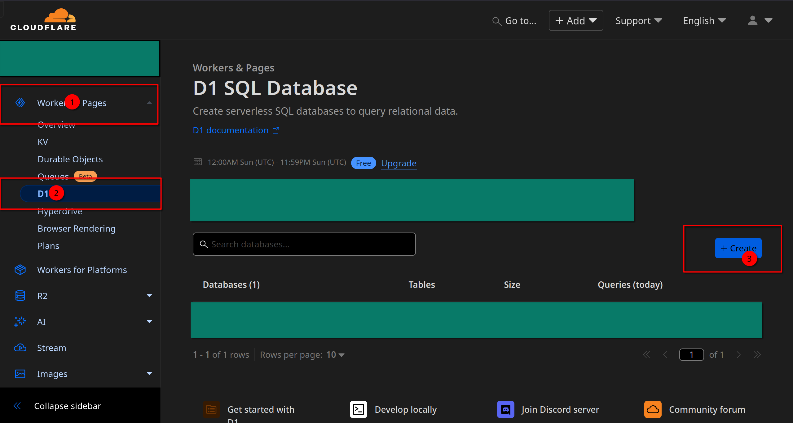
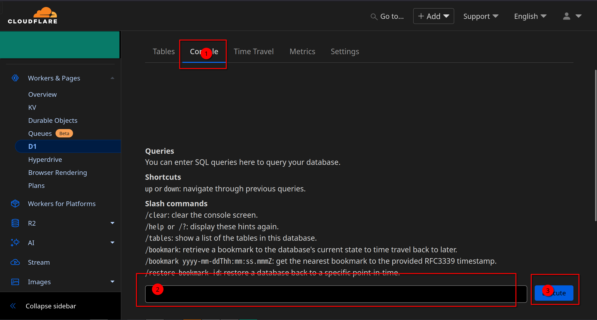

# Pastebin Worker

[](https://deploy.workers.cloudflare.com/?url=https://github.com/xiadd/pastebin-worker)

**Language**: English | [中文](README.zh.md)

A modern, fast, and secure pastebin service built with Cloudflare Workers, featuring text sharing with syntax highlighting, file uploads, password protection, and expiration settings.

## Features

- 📝 **Text Sharing**: Share code snippets and text with syntax highlighting support for multiple languages
- 📁 **File Upload**: Upload and share files up to 25MB
- 🔒 **Password Protection**: Create private pastes with password protection
- ⏰ **Expiration Settings**: Set automatic expiration times (1 minute to 1 month)
- 🎨 **Syntax Highlighting**: Support for JavaScript, TypeScript, Python, Go, C/C++, JSON, YAML, Markdown, CSS, Shell, and more
- 🌐 **Modern UI**: Clean, responsive interface built with React and Tailwind CSS
- 🚀 **Fast Performance**: Powered by Cloudflare Workers edge computing
- 📱 **Mobile Friendly**: Responsive design that works on all devices
- 🔗 **API Access**: RESTful API for programmatic access

## Tech Stack

- **Backend**: Cloudflare Workers with Hono framework
- **Frontend**: React 18 + TypeScript + Vite
- **Database**: Cloudflare D1 (SQLite) with Drizzle ORM
- **Storage**: Cloudflare R2 for file uploads
- **Styling**: Tailwind CSS + Radix UI components
- **Code Editor**: Monaco Editor (VS Code editor)
- **ORM**: Drizzle ORM for type-safe database operations

## Getting Started

### Prerequisites

- Node.js 18+ and Yarn
- Cloudflare account
- Wrangler CLI

### 1. Install Wrangler CLI

```bash
npm install -g wrangler
```

Login to your Cloudflare account:

```bash
wrangler login
```

After running the command, it will open a browser page to log in to Cloudflare. After authorization, run `wrangler whoami` to verify the login was successful.

### 2. Install Dependencies

```bash
# Install backend dependencies
yarn install

# Install frontend dependencies
cd static
yarn install
```

### 3. Create Cloudflare D1 Database

Create a new D1 database in your Cloudflare dashboard:



Create a database named `pastebins`, then enter the database console:



Copy the SQL statements from [schema.sql](src/schema.sql) and execute them in the console to set up the database schema.

Alternatively, you can use Wrangler to initialize the database:

```bash
# For remote database
yarn initdb:remote

# For local development database
yarn initdb:local
```

### Database Migrations with Drizzle ORM

This project uses Drizzle ORM for type-safe database operations. The database schema is defined in `src/db/scheme.ts`. To manage database changes:

```bash
# Generate migration files after schema changes
yarn db:generate

# Apply migrations to local database
yarn db:migrate:local

# Apply migrations to remote database
yarn db:migrate:remote
```

### 4. Create Cloudflare R2 Bucket

Create an R2 bucket for file storage in your Cloudflare dashboard. Name it `pastes` or update the bucket name in `wrangler.toml`.

### 5. Configure wrangler.toml

Update the configuration file with your account details:

```toml
name = "pastebin-worker"
compatibility_date = "2023-10-30"
compatibility_flags = ["nodejs_compat"]

account_id = "<YOUR_ACCOUNT_ID>" # Your Cloudflare account ID
main = "src/index.ts"
workers_dev = false

[vars]
ENVIRONMENT = "production"
BASE_URL = "https://your-domain.com" # Your base URL

[site]
bucket = "./static/dist"

# Comment out if not using custom domain
[[routes]]
pattern = "your-domain.com" # Your custom domain
custom_domain = true

[[r2_buckets]]
binding = 'BUCKET'
bucket_name = 'pastes'

[[d1_databases]]
binding = "DB"
database_name = "pastebins" # Your D1 database name
database_id = "<YOUR_DATABASE_ID>" # Your D1 database ID
```

Replace `<YOUR_ACCOUNT_ID>` and `<YOUR_DATABASE_ID>` with your actual Cloudflare account ID and D1 database ID. If you don't need a custom domain, comment out the `[[routes]]` section.

### 6. Development

```bash
# Start backend development server
wrangler dev

# In another terminal, start frontend development server
cd static
yarn dev
```

The backend will be available at `http://localhost:8787` and the frontend at `http://localhost:5173`. To test the production build, run `yarn build` in the static directory and visit `http://localhost:8787`.

## API Reference

### Text Sharing API

#### Create a Paste

**Endpoint**: `POST /api/create`

**Request Body**:

```json
{
  "content": "Your text content here",
  "isPrivate": false,
  "language": "javascript",
  "share_password": "",
  "expire": 3600
}
```

**Parameters**:

- `content` (string, required): The text content to share
- `isPrivate` (boolean, optional): Whether the paste is private (default: false)
- `language` (string, optional): Syntax highlighting language (default: "text")
- `share_password` (string, optional): Password for private pastes
- `expire` (number, optional): Expiration time in seconds (0 = never expires)

**Response**:

```json
{
  "id": "opNGEX",
  "url": "https://your-domain.com/detail/opNGEX",
  "content": "Your text content here",
  "expire": 3600,
  "language": "javascript",
  "create_time": 1705587763620
}
```

#### Get Paste Details

**Endpoint**: `GET /api/get?id=<paste_id>&share_password=<password>`

**Parameters**:

- `id` (string, required): The paste ID
- `share_password` (string, optional): Password for private pastes

**Response**:

```json
{
  "content": "Your text content here",
  "url": "https://your-domain.com/detail/opNGEX",
  "language": "javascript",
  "create_time": 1705587763620
}
```

#### Get Raw Paste Content

**Endpoint**: `GET /raw/<paste_id>?share_password=<password>`

Returns the raw text content without any formatting.

### File Upload API

#### Upload a File

**Endpoint**: `POST /api/upload`

**Request**: Multipart form data with a `file` field

**Example using curl**:

```bash
curl -X POST https://your-domain.com/api/upload \
  -F "file=@example.txt"
```

**Response**:

```json
{
  "id": "7tAFLZ",
  "url": "https://your-domain.com/file/7tAFLZ"
}
```

#### Access Uploaded Files

**Endpoint**: `GET /file/<file_id>`

Returns the uploaded file with appropriate headers for download or inline viewing.

### Command Line Usage

Create a paste using curl:

```bash
curl 'https://your-domain.com/api/create' \
  -H 'Content-Type: application/json' \
  -d '{
    "content": "console.log(\"Hello World\");",
    "language": "javascript",
    "expire": 3600
  }'
```

## Deployment

### Prerequisites

Before deploying, ensure you have:

1. [Created a Cloudflare D1 database](#3-create-cloudflare-d1-database) and executed the schema
2. [Created a Cloudflare R2 bucket](#4-create-cloudflare-r2-bucket) for file storage
3. [Configured wrangler.toml](#5-configure-wranglertoml) with your account details

### Manual Deployment

To deploy manually using Wrangler:

```bash
# Build the frontend
cd static
yarn build
cd ..

# Deploy to Cloudflare Workers
wrangler deploy
```

### Automated Deployment with GitHub Actions

This project includes a GitHub Actions workflow for automatic deployment on every push to the main branch.

#### Setup GitHub Actions

1. **Get your Cloudflare API Token**:

   - Go to [Cloudflare Dashboard](https://dash.cloudflare.com/profile/api-tokens)
   - Click "Create Token"
   - Use the "Custom token" template with these permissions:
     - Account: Cloudflare Workers:Edit
     - Zone: Zone:Read (if using custom domain)
     - Zone Resources: Include All zones (if using custom domain)

2. **Add the API Token to GitHub Secrets**:

   - Go to your GitHub repository
   - Navigate to Settings → Secrets and variables → Actions
   - Click "New repository secret"
   - Name: `CF_API_TOKEN`
   - Value: Your Cloudflare API token

3. **Deploy**: Push to the main branch and the workflow will automatically deploy your changes.

### One-Click Deployment

Click the deploy button at the top of this README to deploy directly to Cloudflare Workers.

## Database Management

### Initialize Database Schema

```bash
# Initialize remote database (production)
yarn initdb:remote

# Initialize local database (development)
yarn initdb:local
```

### Drizzle ORM Commands

This project uses Drizzle ORM for type-safe database operations:

```bash
# Generate migration files after schema changes
yarn db:generate

# Apply migrations to local database
yarn db:migrate:local

# Apply migrations to remote database
yarn db:migrate:remote
```

### Database Schema

The application uses two main tables defined in `src/db/scheme.ts`:

- `pastes`: Stores text pastes with metadata
- `files`: Reserved for future file metadata (currently files are stored in R2)

All database operations are type-safe thanks to Drizzle ORM, which provides:

- Automatic TypeScript type generation
- SQL query builder with type checking
- Migration management
- Better development experience with IntelliSense

## Configuration

### Environment Variables

Set these in your `wrangler.toml` under `[vars]`:

- `ENVIRONMENT`: Set to "production" for production deployment
- `BASE_URL`: Your application's base URL (e.g., "https://your-domain.com")

### Storage Configuration

- **D1 Database**: Used for storing paste metadata and content
- **R2 Bucket**: Used for file uploads (up to 25MB per file)

## Contributing

1. Fork the repository
2. Create a feature branch
3. Make your changes
4. Test locally using `wrangler dev`
5. Submit a pull request

## License

MIT License - see LICENSE file for details.
